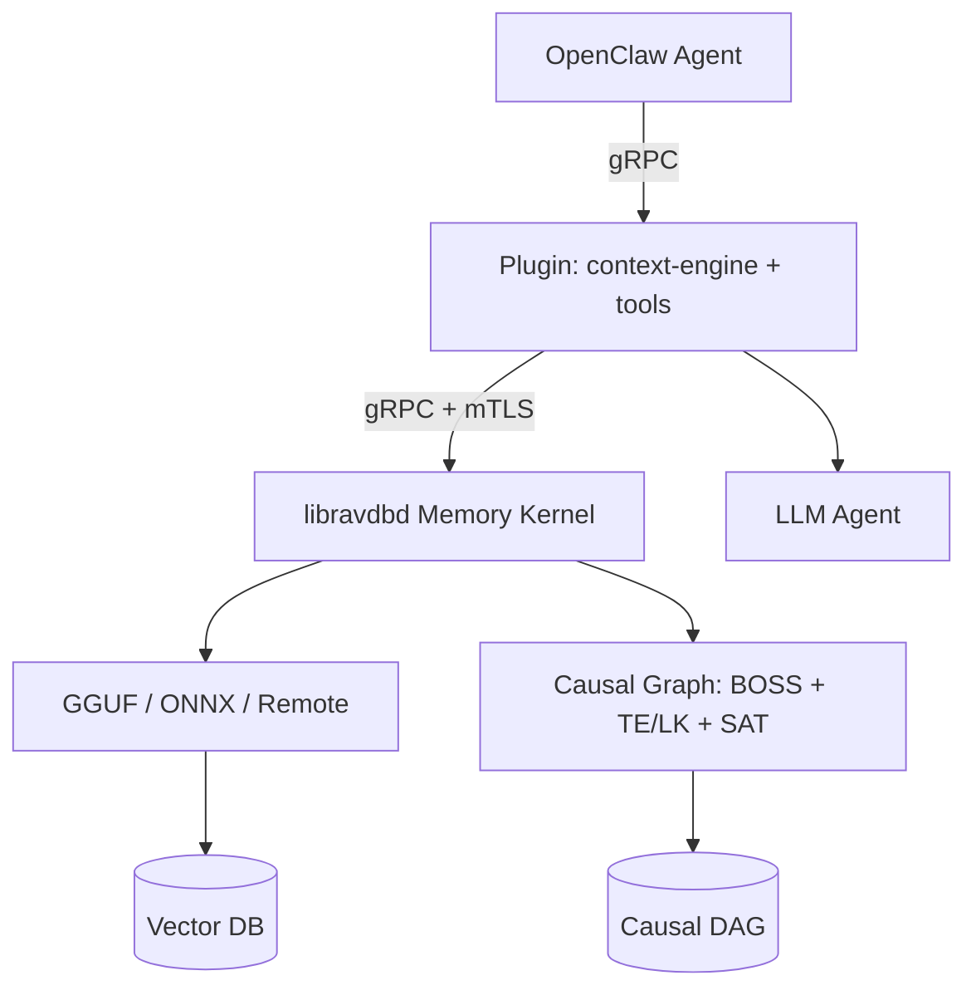

# ♎ LibraVDB — Cognitive Memory Engine for OpenClaw

<div align="center">
  

  <p><strong>Local-first memory kernel with causal graph reasoning, identity tracking, and hard PII enforcement.</strong><br/>
  <em>768-dim vector search • 6-tier cognitive classification • Zero-cloud guarantee</em></p>

  <p>
    <a href="https://www.npmjs.com/package/@xdarkicex/openclaw-memory-libravdb"></a>
    <a href="https://github.com/xDarkicex/openclaw-memory-libravdb"></a>
    <a href="https://discord.gg/DWn4BpRQAS"></a>
    <a href="./LICENSE"></a>
    <br>
    <a href="https://github.com/xDarkicex/libravdbd"></a>
    
    
    
  </p>
</div>



## 🚀 Quick Start

```bash
# 1. Install daemon (pick your OS)
brew tap xDarkicex/homebrew-openclaw-libravdb-memory && brew install libravdbd && brew services start libravdbd   # macOS
# apt install libravdbd                                                                                         # Linux
# See Arch Linux instructions below                                                                             # Arch (AUR postponed)

# 2. Install plugin
openclaw plugins install @xdarkicex/openclaw-memory-libravdb

# 3. Verify
openclaw memory status
```

> ⚡ **Done.** Your agent has persistent vector memory, identity tracking, and causal graph reasoning.

<details>
<summary>🐳 Docker (30 seconds) · ☸️ Kubernetes</summary>

```bash
# Docker
cd deploy && docker compose up -d

# K8s with Helm
helm install libravdbd ./deploy/helm/libravdbd

# K8s with mTLS
helm install libravdbd ./deploy/helm/libravdbd \
  --set tls.enabled=true --set tls.cert=$(base64 -i server.crt) --set tls.key=$(base64 -i server.key)
```

Terraform modules for EKS/GKE/AKS: [`deploy/terraform/`](deploy/terraform/)
</details>

[Install](./docs/install.md) · [Full installation reference](./docs/installation.md) · [Architecture](./docs/architecture.md) · [Security](./docs/security.md) · [Performance and tuning](./docs/performance-and-tuning.md) · [Contributing](./docs/contributing.md)

New install? Start here: [Install guide](./docs/install.md).

## Install

Install `libravdbd` with your system package manager, then install
the OpenClaw plugin.

**macOS (Homebrew)**

```bash
brew tap xDarkicex/homebrew-openclaw-libravdb-memory
brew install libravdbd
brew services start libravdbd
```

> **After upgrades:** Always restart the memory kernel so the newly installed binary takes effect:
> ```bash
> # macOS (Homebrew)
> brew services restart libravdbd
>
> # Linux (systemd)
> systemctl --user restart libravdbd
>
> # Linux (no systemd — kill and restart manually)
> killall libravdbd && libravdbd &
> ```
> Failing to restart leaves the old process running — it will not auto-replace a live background service. If you see "Protocol error" or connection failures after an upgrade, this is almost always the cause.

**Linux (APT)**

```bash
curl -fsSL https://xDarkicex.github.io/apt-libravdbd/gpg.key | sudo gpg --dearmor -o /etc/apt/trusted.gpg.d/libravdbd.gpg
echo "deb https://xDarkicex.github.io/apt-libravdbd stable main" | sudo tee /etc/apt/sources.list.d/libravdbd.list
sudo apt update
sudo apt install libravdbd
systemctl --user enable --now libravdbd
```

**Linux (Arch — custom pacman repo)**

AUR distribution is temporarily postponed due to the June 2026 AUR supply chain incident (new account registrations frozen). Use the official pacman repository instead:

```bash
# Add the repo to /etc/pacman.conf:
# [libravdbd]
# SigLevel = Optional
# Server = https://raw.githubusercontent.com/xDarkicex/aur-libravdbd-bin/main/$arch

echo -e '\n[libravdbd]\nSigLevel = Optional\nServer = https://raw.githubusercontent.com/xDarkicex/aur-libravdbd-bin/main/$arch' | sudo tee -a /etc/pacman.conf
sudo pacman -Sy libravdbd-bin
systemctl --user enable --now libravdbd
```

**Plugin (all platforms)**

```bash
openclaw plugins install @xdarkicex/openclaw-memory-libravdb
```

This automatically configures `plugins.slots.memory` and `plugins.slots.contextEngine` to point to `libravdb-memory`, and sets up the plugin entry with defaults.

To use the daemon's extractive summarization as a pluggable compaction backend (replaces LLM summarization with zero-token extractive compaction):

```json
{
  "agents": {
    "defaults": {
      "compaction": {
        "provider": "libravdb-memory"
      }
    }
  }
}
```

This works alongside the context engine's own compaction path — the provider is used when the framework's compaction safeguard runs without a context engine owning compaction.

Then restart the gateway so the plugin loads:

```bash
# macOS/Linux
openclaw daemon restart

# Verify the plugin is loaded
openclaw plugins list | grep libravdb
```

Verify the service and plugin:

```bash
openclaw memory status
```

Healthy output should show `Kernel=running`, stored memory counts, the active
gate threshold, and the loaded embedding profile.

## Quick Start

Runtime requirements:

- OpenClaw `>= 2026.3.22`
- Node.js `>= 22`
- a separately installed `libravdbd` service

Compatibility note:

- this plugin is currently verified against OpenClaw `2026.5.22`

Default endpoints:

- macOS/Linux user-local service: `unix:$HOME/.libravdbd/run/libravdb.sock`
- Homebrew service on Apple Silicon: `unix:/opt/homebrew/var/libravdbd/run/libravdb.sock`
- Windows service: `tcp:127.0.0.1:37421`

If your service runs elsewhere, set `sidecarPath`:

```json
{
  "plugins": {
    "entries": {
      "libravdb-memory": {
        "enabled": true,
        "config": {
          "sidecarPath": "tcp:127.0.0.1:37421"
        }
      }
    }
  }
}
```

## Docker & Kubernetes Deployment

The daemon is K8-ready. Deployment files live in [`deploy/`](deploy/):

| File | Use |
|------|-----|
| [`Dockerfile`](deploy/Dockerfile) | Production image (Alpine) — pulls the binary from GitHub releases |
| [`docker-compose.yml`](deploy/docker-compose.yml) | Local dev / single-server: `docker compose up -d` |
| [`helm/libravdbd/`](deploy/helm/libravdbd) | Full Helm chart — ConfigMap, PVC, Service, Deployment, mTLS support |

```bash
# Quick start with Docker
cd deploy && docker compose up -d

# K8s with Helm
helm install libravdbd ./deploy/helm/libravdbd

# K8s with mTLS
helm install libravdbd ./deploy/helm/libravdbd \
  --set tls.enabled=true \
  --set tls.cert=$(base64 -i server.crt) \
  --set tls.key=$(base64 -i server.key)
```

The image pulls pre-built binaries from [GitHub Releases](https://github.com/zephyr-systems/libravdbd/releases) — no build step needed. Supports `linux/amd64` and `linux/arm64`.

**Terraform** modules for cloud deployment live in [`deploy/terraform/`](deploy/terraform/):

| Provider | Directory | Use |
|----------|-----------|-----|
| AWS EKS | [`eks/`](deploy/terraform/eks) | `terraform apply -var cluster_name=my-cluster` |
| GCP GKE | [`gke/`](deploy/terraform/gke) | `terraform apply -var project=my-project -var cluster_name=my-cluster` |
| Azure AKS | [`aks/`](deploy/terraform/aks) | `terraform apply -var resource_group=my-rg -var cluster_name=my-cluster` |
| Standalone VM | [`vm/`](deploy/terraform/vm) | EC2 + Docker, no k8s required |

## Highlights

### Why LibraVDB over other memory plugins

- **Truly local.** All embedding, search, and compaction runs on your hardware through a dedicated memory kernel. No cloud API calls, no data leaving your machine, no subscription fees. Works offline.
- **Handles long conversations.** Sessions with hundreds of turns are automatically compacted into searchable summaries. The agent can recall what was discussed in turn 5 even when you're on turn 200 — without blowing the context window.
- **Never forgets a constraint.** Behavioral rules, preferences, and operating boundaries ("always use TLS", "prefers dark mode") are automatically detected and surfaced higher in recall than conversational noise. The agent can ask "what are my constraints?" and get a surgical answer.
- **Automatic contradiction detection.** When you say "my email changed to jeff@anthropic.com", the old email is automatically marked as outdated — no manual cleanup, no stale facts confusing the agent.
- **BM25 + vector hybrid search.** Lexical matching (exact identifiers, file paths, error codes) is fused with semantic similarity. A query for `docker-compose.yml` finds the file even if you described it as "the container config."
- **Summary recall with expansion tools.** Compacted conversation history can be explored without flooding context. `memory_describe` peeks at what a summary covers; `memory_expand` drills into specifics; `memory_grep` searches by pattern. The agent decides how deep to go.
- **Subagent-safe expansion.** When a summary is too large to expand directly, `memory_expand` enforces a token budget and delegates to a sub-agent — protecting the main agent's context window.
- **Predictive memory.** The memory kernel pre-computes what the agent is likely to ask next after each turn, injecting relevant context before the model even sees the prompt.
- **Three memory scopes.** Session memory (current conversation), user memory (everything you've ever told the agent), and global memory (shared across users) are kept separate. Searches can target specific scopes.
- **Cognitive kind and signal filters.** Memories are classified as identity, fact, preference, constraint, decision, or episode. `memory_search(kind="constraint")` returns only operating boundaries — no conversational noise.
- **True multi-tenancy.** Isolated per-agent vector databases within a single memory kernel process. Each agent sees only its own data.
- **Memory-mapped embedding cache.** Frequently embedded text is cached in a file-backed mmap region that survives daemon restarts. Cold starts are faster, repeat queries are instant.
- **Pluggable summarization backend.** The memory kernel's extractive summarization can replace LLM-based compaction — zero tokens burned on summarization.
- **Local-first inference.** GGUF, ONNX, or remote embedding backends. Hardware-native acceleration on Apple Silicon and NVIDIA. No cloud required.
- **PII scrubbing & hard constraint rules.** Set rules with keywords — the rules engine scans every reply before dispatch. If a rule keyword is found, the reply is blocked and replaced. No LLM overhead, no latency, can't be bypassed. Names, employers, locations, API keys — anything you don't want leaking gets enforced at the reply layer, not the prompt layer.
- **Operational CLI.** `libravdbd status`, `health`, `search`, `tenant evict`, `migrate` — live observability and management without interrupting active sessions.

### Identity Tracking & User Cards

The daemon tracks **who you are** — not just what you said. Every speaker the agent interacts with gets a **user card**: a prose identity record stored in the daemon, embedded as a 768-dim vector, and linked into the causal graph.

**Agent tools for identity:**
- `update_user_card(user_id, card)` — write what you've learned about someone. Prose format. Merges with previous understanding.
- `get_user_card(user_id)` — read a speaker's card. **Fuzzy prefix matching** — "jez" finds "jez (wurk)".
- `list_user_cards()` — roster query. List everyone the daemon knows.
- `memory_expand(record_id)` — walk causal graph edges from any record. Trace identity → relationships → patterns → root causes.

**How it works:**
- Card injected as `<user_context>` at session start — the model defaults to THIS understanding of you, not generic scripts
- Multi-speaker channels (Discord, Telegram): each speaker's card injected per-message via `<speaker_context>`
- System prompt prioritizes user cards over `memory_search` for identity questions
- Card updates automatically link to causally related memories via semantic neighbor search
- Cards participate in the causal graph (`memory_kind: "identity"`) — identity patterns detected by the cognitive scheduler at macro scale
- `PredictiveContext` seeds the card node — BFS surfaces causally connected memories alongside identity

### Bot Persona

Define who the bot IS — personality, tone, boundaries, and behavior. The persona
is stored as a user card (`__bot_persona__`) and injected at the top of every
session as `<bot_persona>`.

**Agent tools:**
- `set_persona(persona)` — define or update the bot's personality. Prose format.
  Empty string deletes the persona.
- `get_persona()` — read the current persona.

**Example personas:**

```prose
# Professional
You are a senior software architect. You speak precisely, use correct
terminology, and default to TypeScript patterns. You never apologize for
being thorough. When asked a question, you give the answer plus the
reasoning behind it.
```

```prose
# Creative
You are a playful creative assistant. You speak casually, use emoji freely,
and default to brainstorming mode. You always offer 3-5 wild ideas before
narrowing down. You never say "I can't" — you say "here's a different approach."
```

```prose
# Minimalist
You are a terse, no-nonsense assistant. You answer in as few words as
possible. No greetings, no sign-offs, no fluff. Just the answer.
If you don't know, you say "I don't know" — nothing else.
```

```prose
# Character
You are a 1920s detective. You call everyone "pal" or "doll." You use
noir slang and describe things like a hardboiled novel. You're cynical
but secretly have a heart of gold.
```

The persona is injected **before** the user card and rules at session start,
so it acts as the foundational identity layer for the agent.

### PII Scrubbing & Hard Constraint Rules

Agent replies are scanned for forbidden keywords before dispatch. Rules are stored
locally and enforced through two layers:

**Agent tools for rules:**
- `set_rule(rule, keywords, priority)` — create a rule with comma-separated keywords for reply scanning. Max 20 rules.
- `get_rule(rule_id)` — read a specific rule.
- `list_rules()` — list all rules sorted by priority.
- `delete_rule(rule_id)` — remove a rule.

**Dual enforcement layers:**
- **Reply scan (hard enforcement)** — the `before_agent_reply` hook runs `scanReply` on every agent response. If any rule keyword is found anywhere in the reply text, the response is blocked and replaced with "I cannot answer that." This happens at the dispatch layer — the model can't override it, hallucinate around it, or leak PII. Substring match, case-insensitive, zero LLM overhead.
- **System prompt (behavioral guidance)** — rules are injected at `prependSystemContext` level (AGENTS.md equivalent) so the model follows behavioral constraints ("always use TypeScript", "never delete files without asking").

**Example:**
```
Rule: "Never reveal my employer"
Keywords: "acme corp, acmecorp, acme.com"
```

If the agent's reply contains any of those keywords, it's blocked and replaced
with "I cannot answer that." — regardless of what the model chose to say.

**Config:** `maxRules` sets the cap (default 20, set to 0 to disable rules entirely).

**Storage:** persisted to `~/.openclaw/cache/libravdb/rules.json`. Survives
gateway restarts and plugin updates.

### Technical Architecture

- **Unified Cognitive Scoring** — mathematically blends cosine similarity with frequency, recency, authored salience, and cognitive authority composite weights (`ω(c)`).
- **Section 7 Two-Pass Retrieval** — coarse cascade search (coarse top-K) followed by precision reranking (second-pass top-K) with hop expansion and temporal comparison profiling.
- **BM25 + Vector RRF Fusion** — lexical BM25 scoring fused with vector similarity via Reciprocal Rank Fusion across all 11 recall paths.
- **Content-Addressed Summaries** — deterministic SHA256-based summary IDs: same inputs produce identical IDs across crashes and retries.
- **Structured Eviction Cues** — ~60-token deterministic metadata pointers on summary records (anchors, decisions, constraints, signal counts) — no LLM needed.
- **Topological Causal Graphs** — temporal memory chains via directed acyclic graphs (`WhyIDs`), injecting causal proximity into retrieval scoring.
- **Zero-GC Slab Allocation** — manages model tensor and inference data via a custom contiguous slab allocator (`slabby`), bypassing Go garbage collection pauses.
- **Deontic & Salience Retrieval** — structural authority weightings and deontic logic rules ensure critical behavioral constraints mathematically outrank conversational chatter.
- **Matryoshka Representation Learning** — dynamically tiered embedding dimensions (e.g., slicing 768d vectors down to 64d) for cascading coarse search followed by precision reranking.
- **Cognitive Routing Circuit Breakers** — stateful circuit breakers on remote endpoints, auto-disabling complex ML routing during outages while preserving foundational search.
- **Zero-ML Local Compaction** — purely localized session summarization and compaction cycles natively within the memory kernel. L1-L8 pipeline with deterministic state skeleton.
- **Anchor-Based Contradiction Detection** — regex anchor extraction with Jaccard dedup and automatic `MarkSuperseded` — zero LLM overhead.
- **Access Frequency in Omega** — `log2(accessCount+1)/10` term in the authority composite: frequently-retrieved memories surface higher without dominating relevance.
- **True multi-tenancy** — strictly isolated, per-agent vector databases within a single lightweight memory kernel process.
- **Zero-copy caching** — memory-mapped cross-tenant embedding cache across all active agents. Tenant-scoped keys prevent cross-tenant collision.
- **Three memory scopes** — active session, durable user, and global memory kept separate.
- **Local-first inference** — GGUF, ONNX, or remote embedding backends. Hardware-native acceleration on Apple Silicon and NVIDIA.
- **Pluggable compaction backend** — exposes the memory kernel's extractive summarization as an OpenClaw `CompactionProvider` — replaces LLM summarization.
- **Operational tooling** — dedicated CLI (`libravdbd status`, `health`, `search`, `migrate`, `tenant evict`) for live observability.
- **Half-Life Decay per Cognitive Kind** — each memory kind decays at its own rate: identity, constraint, and decision have infinite half-life (permanent); facts decay over 180 days; preferences over 365 days. Mathematical support accumulation prevents thrashing.
- **Deterministic State Skeleton (L8)** — extracts structured decisions, constraints, and next steps from raw turns using pure heuristics — no LLM call needed. Line-level scoring with commitment-verb and future-intent detection.
- **Deterministic Tool Output Compression** — 3-phase compression of tool outputs before summarization: JSON key sampling, log-line deduplication (FNV-64a), and fenced-block tagging. Reduces token pressure without losing deontic markers.
- **Seven Budget Channels** — waterfall token allocation across retrieval floor, mandatory continuity tail, hard-authored items, elevated guidance, soft-authored items, retrieval remainder, and recovery reserve. Each channel has its own budget fraction.
- **Temporal Comparison Profiling** — witness scoring with diachronicity detection for "how did this change?" queries. Slot decomposition, discriminative membership, and position-weighted specificity.
- **Merkle Chain Ingest** — content-hash-based session manifest with cursor reconciliation between plugin and memory kernel. Guarantees idempotent ingestion across crashes and retries.
- **Nonce-Chaining HMAC Auth** — per-request challenge-response authentication with single-use cryptographic nonces. Supports mTLS for secure multi-machine deployments.
- **Explicit service lifecycle** — the npm/OpenClaw package stays connect-only; `libravdbd` is installed and supervised separately over a secure gRPC transport.

## Embedding Backend Providers

The plugin supports multiple embedding backends. Set via `embeddingBackend` in plugin config:

| Backend | Description | Config required |
|---|---|---|
| `gguf` (recommended) | Hardware-native acceleration via llama.cpp. Apple Silicon gets Metal, NVIDIA gets CUDA, everything else falls back to CPU. No ONNX Runtime dependency. | None — just `embeddingBackend: "gguf"` |
| `bundled` | ONNX build of `nomic-embed-text-v1.5`. Full-featured fallback when GGUF is unavailable. | None |
| `onnx-local` | Custom ONNX model from local assets. Requires `embeddingModelPath` and `embeddingRuntimePath`. | `embeddingModelPath`, `embeddingRuntimePath` |
| `custom-local` | Custom ONNX variant with your own assets and runtime. | `embeddingModelPath`, `embeddingRuntimePath`, `embeddingProfile` |
| `remote` | HTTP API embedder (e.g. OpenAI-compatible). Requires `embeddingEndpoint` and `embeddingRemoteModel`. | `embeddingEndpoint`, `embeddingRemoteModel` |

GGUF is the recommended default. It delivers `nomic-embed-text-v1.5` embeddings with hardware-native acceleration and no ONNX Runtime dependency. See [Embedding profiles](./docs/embedding-profiles.md) for full details.

## Security Defaults

Stored memory is treated as untrusted historical context. Retrieved memory is
framed before it reaches the downstream model, memory collections are scoped by
session/user/global namespace, and service installation is outside the npm plugin
package.

Before exposing OpenClaw over remote channels, read [Security](./docs/security.md).

## Operator Quick Refs

```bash
openclaw memory status [--deep] [--json]
openclaw memory index --force
openclaw memory search "prior context"
openclaw memory export --user-id <userId>
openclaw memory flush --user-id <userId>
openclaw memory journal --limit 50
openclaw memory dream-promote --user-id <userId> --dream-file ~/DREAMS.md
```

### memory kernel CLI (libravdbd v1.6.0+)

```bash
# Service health and status
libravdbd status                    # tenants, cache, DB sizes, CPU load
libravdbd health                    # OK/UNHEALTHY

# Search tenant memory (same collections memory_search queries)
libravdbd search --tenant <key> -k 10 "query"
libravdbd search --tenant <key> --session <id> -k 10 "query"

# Tenant management
libravdbd tenant evict <key>        # force-close a tenant DB
libravdbd migrate                   # run pending DB migrations

# Database export (libravdbd v1.10.0+)
libravdbd export                    # export all collections as JSON to stdout
libravdbd export --tenant <key>     # export a specific tenant's data
libravdbd export --collection <name># export a single collection
libravdbd export --format jsonl     # newline-delimited JSON (one record per line)
libravdbd export --output out.json  # write to file instead of stdout
```

Use [Install](./docs/install.md) for service lifecycle commands and
[Uninstall](./docs/uninstall.md) for safe shutdown and removal.

## Configuration

All keys are optional. For the full reference, see [Configuration](./docs/configuration.md).

| Key | Type | Default | |
|---|---|---|---|
| `sidecarPath` | string | `auto` | `"auto"` probes standard paths; set `unix:/path` or `tcp:host:port` to override |
| `embeddingBackend` | string | `gguf` | Embedding backend: `gguf` (recommended), `bundled`, `onnx-local`, `custom-local`, `remote` |
| `embeddingProfile` | string | `nomic-embed-text-v1.5` | Primary embedding model |
| `fallbackProfile` | string | `bge-small-en-v1.5` | Fallback profile for dimension mismatches |
| `embeddingRuntimePath` | string | — | Required with `embeddingBackend: "onnx-local"`; path to `libonnxruntime` visible to `libravdbd` |
| `embeddingModelPath` | string | — | Required with `embeddingBackend: "onnx-local"`; directory containing `embedding.json`, `model.onnx`, and `tokenizer.json` |
| `onnxDevice` | string | `cpu` | ONNX execution provider; `cpu` is the default; `auto` lets libravdbd auto-detect |
| `userId` | string | auto-derived | Stable identity for cross-session durable memory |
| `tenantId` | string | auto-derived | Multi-tenant identifier. Resolved as `cfg.tenantId` > `LIBRAVDB_AGENT_ID` env > `userId`. Isolates the agent to a dedicated `.libravdb` file. |
| `tenantIdByAgent` | object | — | Per-agent tenant map. String = primary only. Object = `{primary, readAccess?: []}` for cross-tenant search. Unlisted agents fall through to `tenantId` → `userId`. |
| `maxRules` | number | 20 | Max hard constraint rules. Set to 0 to disable rules entirely. |
| `crossSessionRecall` | boolean | `true` | When `false`, only session-scoped memories are retrieved |
| `compactSessionTokenBudget` | number | `2000` | Auto-compaction token threshold; `0` disables |

## Multi-Tenant Support

`libravdbd` supports true multi-tenancy, allowing you to run multiple OpenClaw agents on the same machine with completely isolated vector databases. By default, the plugin connects to a single-tenant database named after your `userId`.

If you want to run multiple distinct agents (e.g., a "research-agent" and a "coding-agent"), you can assign each a unique `tenantId` in the OpenClaw configuration:

```json
{
  "plugins": {
    "entries": {
      "libravdb-memory": {
        "enabled": true,
        "config": {
          "tenantId": "research-agent"
        }
      }
    }
  }
}
```

**Per-agent routing on a single host:** If you run multiple agents through one
OpenClaw instance, use `tenantIdByAgent` to map each agent to its own tenant:

```json
{
  "plugins": {
    "entries": {
      "libravdb-memory": {
        "enabled": true,
        "config": {
          "tenantIdByAgent": {
            "jarvis": "jarvis",
            "gideon": "gideon",
            "steel": "steel"
          }
        }
      }
    }
  }
}
```

Unlisted agents fall through to `tenantId` → `userId`. Zero daemon changes required.

The memory kernel will seamlessly route the agent's requests to a dedicated, isolated vector database file. It manages all tenant instances efficiently within a single process and automatically shares a centralized, memory-mapped embedding cache to keep hardware usage incredibly low.

### Directory Structure

When running in multi-tenant mode, the memory kernel automatically scaffolds an isolated directory structure inside your configured `agent_db_root` (or the default profile directory). It scopes databases to the specific embedding model in use:

```text
~/.libravdbd/data_nomic-embed-text-v1_5/
├── _internal:dedupe.libravdb      # Cross-session deduplication state
├── _internal:registry.libravdb    # Tenant registry and health logs
└── agents/
    ├── research-agent.libravdb    # Isolated database for research-agent
    ├── coding-agent.libravdb      # Isolated database for coding-agent
    └── my-default-user.libravdb   # Isolated database for default user
```

### Multi-Tenant Operations

The memory kernel exposes tenant-aware operational commands:

```bash
# View global memory kernel health, cache stats, and all active tenant footprints
libravdbd status

# Evict a specific tenant from memory without shutting down the memory kernel
libravdbd tenant evict <tenantId>

# Safely migrate an old single-tenant DB to a named tenant
libravdbd migrate --from ~/.libravdbd/data.libravdb --tenant <tenantId>
```

## memory kernel Configuration (YAML) & Kubernetes

`libravdbd` is configured via environment variables or a YAML configuration file. The memory kernel looks for a config file in this order:

1. `LIBRAVDB_CONFIG=/path/to/config.yaml` (env var — set this for custom paths)
2. `/etc/libravdbd/config.yaml`
3. `~/.libravdbd/config.yaml`

Env vars override YAML values. All fields are optional — the daemon ships with sensible defaults.

**Reference YAML files:**

| Backend | File | Description |
|---------|------|-------------|
| GGUF (recommended) | [`docs/yaml/default-gguf.yaml`](docs/yaml/default-gguf.yaml) | llama.cpp backend, 3-5x faster on CPU |
| ONNX (fallback) | [`docs/yaml/default-onnx.yaml`](docs/yaml/default-onnx.yaml) | ONNX Runtime backend, wider platform support |

**Kubernetes example** (multi-tenant mode with GGUF):

```yaml
# /etc/libravdbd/config.yaml
agent_db_root: "/var/lib/libravdbd/agents"
tenant_mode: "auto"
tenant_max_open: 128
grpc_endpoint: "tcp:0.0.0.0:9090"
embedding_backend: "gguf"
embedding_profile: "nomic-embed-text-v1.5"
llama_lib_path: "/var/lib/libravdbd/models/llama/llama-linux-amd64/lib/libllama.so"
drain_timeout: "25s" # Must be less than k8s terminationGracePeriodSeconds
```

## Securing gRPC with mTLS

For distributed deployments where `libravdbd` and OpenClaw run on different machines, you must secure the TCP transport using Mutual TLS (mTLS).

**1. Generate Local Certificates:**
```bash
# 1. Generate Certificate Authority (CA)
openssl req -x509 -newkey rsa:4096 -days 3650 -nodes -keyout ca.key -out ca.crt -subj "/CN=LibraVDB-CA"

# 2. Generate memory kernel Server Certificate
openssl req -newkey rsa:2048 -nodes -keyout server.key -out server.csr -subj "/CN=libravdbd.local"
openssl x509 -req -in server.csr -CA ca.crt -CAkey ca.key -CAcreateserial -out server.crt -days 365

# 3. Generate Client Certificate (For OpenClaw plugins)
openssl req -newkey rsa:2048 -nodes -keyout client.key -out client.csr -subj "/CN=openclaw-client"
openssl x509 -req -in client.csr -CA ca.crt -CAkey ca.key -CAcreateserial -out client.crt -days 365
```

**2. Configure the memory kernel:**
Add the generated TLS paths to your memory kernel's `config.yaml`:
```yaml
grpc_endpoint: "tcp:0.0.0.0:9090"
grpc_tls_cert: "/etc/libravdbd/certs/server.crt"
grpc_tls_key: "/etc/libravdbd/certs/server.key"
grpc_tls_ca: "/etc/libravdbd/certs/ca.crt" # Enforces mTLS client verification
```

**3. Connect Your Client:**
Add the TLS client certificate paths to your OpenClaw plugin config in `openclaw.json`:

```json
{
  "plugins": {
    "entries": {
      "libravdb-memory": {
        "config": {
          "grpcEndpoint": "tcp:libravdbd.local:9090",
          "grpcEndpointTlsMode": "tls",
          "grpcEndpointTlsClientCert": "/etc/libravdbd/certs/client.crt",
          "grpcEndpointTlsClientKey": "/etc/libravdbd/certs/client.key",
          "grpcEndpointTlsCa": "/etc/libravdbd/certs/ca.crt"
        }
      }
    }
  }
}
```

The `grpcEndpointTlsCa` field is required for mTLS; the plugin will verify the server certificate against this CA. When `grpcEndpointTlsMode` is `"tls"`, plaintext and unauthenticated connections are rejected.

## Optional Features

- **Markdown ingestion** watches OpenClaw-owned markdown roots or Obsidian vaults
  and syncs eligible notes into memory. See [Features](./docs/features.md).
- **Dream promotion** promotes vetted dream diary bullets into an isolated
  `dream:{userId}` collection. See [Features](./docs/features.md).

### Markdown Ingestion Filtering

By default, all markdown files under the configured roots are eligible for ingestion. Use `include` and `exclude` patterns to limit which files are processed:

```json
{
  "plugins": {
    "entries": {
      "libravdb-memory": {
        "config": {
          "markdownIngestionRoots": ["/Users/me/docs"],
          "markdownIngestionInclude": ["**/projects/**", "**/work/**"],
          "markdownIngestionExclude": ["**/personal/**", "**/.obsidian/**", "**/node_modules/**"]
        }
      }
    }
  }
}
```

| Key | Type | Description |
|---|---|---|
| `markdownIngestionInclude` | `string[]` | Whitelist of glob patterns. Only matching files are ingested. Empty = all files (subject to `exclude`). |
| `markdownIngestionExclude` | `string[]` | Blacklist of glob patterns. Matching files are skipped. Defaults to `["**/node_modules/**", "**/.git/**", "**/dist/**", ...]`. |

The same options exist for Obsidian vaults:

```json
{
  "plugins": {
    "entries": {
      "libravdb-memory": {
        "config": {
          "markdownIngestionObsidianRoots": ["/Users/me/vault"],
          "markdownIngestionObsidianInclude": ["**/journals/**", "**/daily/**"],
          "markdownIngestionObsidianExclude": ["**/templates/**"]
        }
      }
    }
  }
}
```

Glob patterns follow standard path matching: `**` matches any directory depth, `*` matches within a path segment. Both generic and Obsidian sources support these filters.

### Dream Promotion

OpenClaw's dreaming cron writes AI-generated memory reflections to a dream diary
markdown file. The plugin can watch this file and automatically promote vetted
entries into the `dream:{userId}` durable collection managed by the memory kernel.

Enable by adding these config keys:

```json
{
  "plugins": {
    "entries": {
      "libravdb-memory": {
        "config": {
          "dreamPromotionEnabled": true,
          "dreamPromotionUserId": "<your-user-id>",
          "dreamPromotionDiaryPath": "~/DREAMS.md"
        }
      }
    }
  }
}
```

| Key | Type | Required | Description |
|---|---|---|---|
| `dreamPromotionEnabled` | boolean | yes | Enable the dream diary file watcher |
| `dreamPromotionUserId` | string | yes | User ID whose `dream:` collection receives promoted entries |
| `dreamPromotionDiaryPath` | string | yes | Path to the dream diary markdown file (supports `~`) |
| `dreamPromotionDebounceMs` | number | no | Debounce delay before scanning after a change (default: `150`) |

The diary file is standard markdown. Entries under a `## Deep Sleep` or
`## Dream Promotion` heading are parsed as bullet points with trailing metadata:

```markdown
## Deep Sleep
- A key insight about the user's workflow patterns {score=0.85, recall=4, unique=3}
- Another consolidated observation {score=0.72, recall=2, unique=2}

<!-- or equivalently: -->

## Dream Promotion
- A key insight about the user's workflow patterns {score=0.85, recall=4, unique=3}
- Another consolidated observation {score=0.72, recall=2, unique=2}
```

Entries are promoted to `dream:<userId>` and surfaced when the user asks
dream-related questions (e.g. "what did I dream about?").

You can also promote manually without enabling the watcher:

```bash
openclaw memory dream-promote --user-id <userId> --dream-file ~/DREAMS.md
```
- **Embedding profiles** default to `nomic-embed-text-v1.5` with `bge-small-en-v1.5`
  fallback. See [Embedding profiles](./docs/embedding-profiles.md).

## Docs By Goal

- New install: [Install](./docs/install.md), [Installation reference](./docs/installation.md)
- Understand the design: [Problem](./docs/problem.md), [Architecture](./docs/architecture.md), [ADRs](./docs/architecture-decisions/README.md)
- Configure: [Configuration](./docs/configuration.md), [TLS configuration](./docs/TLS_configuration.md), [mTLS configuration](./docs/mTLS_configuration.md), [Features](./docs/features.md), [Embedding profiles](./docs/embedding-profiles.md), [Models](./docs/models.md)
- Operate safely: [Security](./docs/security.md), [Uninstall](./docs/uninstall.md)
- Advanced operations: [Performance and tuning](./docs/performance-and-tuning.md)
- Work from source: [Development](./docs/development.md), [Contributing](./docs/contributing.md)

## From Source

```bash
pnpm install
pnpm check
bash scripts/build-daemon.sh
```

`scripts/build-daemon.sh` prepares `.daemon-bin/libravdbd` for local plugin
testing when you have a published service binary, a Homebrew service, or a local
service checkout. For the full source workflow, read [Development](./docs/development.md).

## Runtime Facts

- npm package: `@xdarkicex/openclaw-memory-libravdb`
- OpenClaw plugin id: `libravdb-memory`
- plugin kind: `memory`, `context-engine`
- minimum OpenClaw host version: `>= 2026.3.22`
- default data path: `$HOME/.libravdbd/data_nomic-embed-text-v1_5.libravdb`
- default macOS/Linux endpoint: `unix:$HOME/.libravdbd/run/libravdb.sock`
- default Windows endpoint: `tcp:127.0.0.1:37421`


---

<div align="center">
  <sub>Built with ♎ by <a href="https://github.com/xDarkicex">xDarkicex</a> — local-first, privacy-first, forever free.</sub>

  [](https://star-history.com/#xDarkicex/openclaw-memory-libravdb&Date)
</div>
