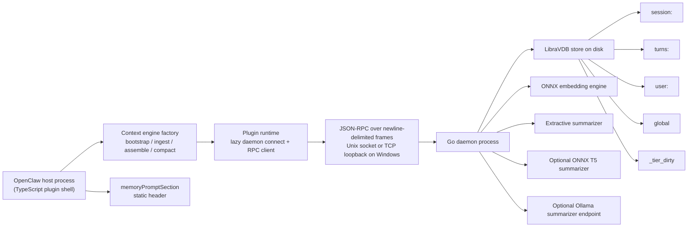

# System Architecture

This document describes the current implemented architecture, not just the
design intent. Every component and data flow here maps to code in the
repository as of the current `main` branch.

## 1. Component Map

Implementation anchors:

- plugin entry: [`src/index.ts`](../src/index.ts)
- lazy runtime startup: [`src/plugin-runtime.ts`](../src/plugin-runtime.ts)
- daemon supervision and endpoint discovery: [`src/sidecar.ts`](../src/sidecar.ts)
- transport listener: [`sidecar/server/transport.go`](../sidecar/server/transport.go)
- RPC method table: [`sidecar/server/rpc.go`](../sidecar/server/rpc.go)
- store: [`sidecar/store/libravdb.go`](../sidecar/store/libravdb.go)

## 2. Single-Turn Data Flow

### 2.1 `ingest`

Implemented in [`src/context-engine.ts`](../src/context-engine.ts).

For every non-heartbeat message:

1. The host gets an RPC client from the plugin runtime. This lazily connects to
   the configured daemon endpoint when the plugin is first used.
2. The message is written to `session:<sessionId>` with `type: "turn"`.
3. If `message.role === "user"`, the same text is written to `turns:<userId>`.
4. The host calls `gating_scalar` with `{ userId, text }`.
5. If `g >= ingestionGateThreshold`, the turn is promoted into
   `user:<userId>` with the full gating decomposition in metadata.

Important constraints from the current implementation:

- session insertion is fire-and-forget
- durable promotion is best-effort
- gating failure does not fail the user turn
- assistant turns are stored in session memory but are not promoted into
  durable user memory

### 2.2 `memoryPromptSection`

Implemented in [`src/memory-provider.ts`](../src/memory-provider.ts).

Before the main assembly path runs, the plugin returns a lightweight static
header fragment that tells the host persistent memory is active.

This path is intentionally synchronous and does not perform RPC retrieval.
Durable recall now happens entirely inside `assemble`, which keeps embedded
prompt construction compatible with OpenClaw's synchronous memory prompt hook.

### 2.3 `assemble`

Implemented in [`src/context-engine.ts`](../src/context-engine.ts).

For the current query text (last message content), the host:

1. builds an exclusion set from the most recent message ids
2. searches `session:<sessionId>`, `user:<userId>`, and `global` in parallel
3. hybrid-ranks the combined results using host-side scoring
4. fits the ranked set to `tokenBudget * tokenBudgetFraction`
5. prepends the selected memories as synthetic `system` messages
6. returns both the expanded message array and a `systemPromptAddition`

Current implementation details that matter:

- user/global hits are cached within `assemble` and reused on repeated queries
- `assemble` falls back to the unmodified message list on RPC failure
- `assemble` does not mutate the original `messages` array in place; it returns
  a new array

## 3. Compaction Data Flow

Implemented primarily in [`src/context-engine.ts`](../src/context-engine.ts)
and [`sidecar/compact/summarize.go`](../sidecar/compact/summarize.go).

When compaction is triggered:

1. the host calls `compact_session` with `{ sessionId, force, targetSize }`
2. the daemon loads eligible non-summary turns from `session:<sessionId>`
3. turns are sorted by `(ts, id)` and partitioned into deterministic
   chronological clusters
4. each cluster is routed to:
   - extractive summarization by default
   - optional abstractive summarization if `mean(gating_score) >= 0.60` and an
     abstractive summarizer is ready
5. the summary record is inserted back into the same session collection
6. source turns are deleted only after summary insertion succeeds

Current implementation facts:

- compaction only touches `session:<sessionId>`
- raw source turns are preserved if summary insertion fails
- delete failure logs and leaves the inserted summary in place
- compaction logs `cluster_id`, `mean_gating_score`, and `summarizer_used`

## 4. Failure Modes and Degraded Behavior

The table below reflects current code behavior, with notes where it diverges
from the original spec phrasing.

| Failure | Current behavior | User impact |
|---|---|---|
| Daemon unavailable on first RPC use | `getRpc()` rejects when first connect or health check fails | That hook fails or falls back, but plugin registration itself does not crash eagerly |
| Daemon connection closes mid-session | `SidecarSupervisor` retries with exponential backoff until retry budget is exhausted, then enters degraded mode | Memory becomes unavailable until the daemon is reachable again |
| `memoryPromptSection` failure | returns a static header with no RPC dependency | Prompt section stays available and does not block the run |
| `assemble` RPC failure | returns original messages, original token count, and empty `systemPromptAddition` | That turn gets no recall augmentation |
| `ingest` gating or durable insert failure | session write already happened; durable promotion is skipped | Session memory survives, durable memory may miss that turn |
| Compaction summarizer unavailable | extractive summarizer remains required; optional abstractive path is skipped | Compaction still runs extractively when extractive is healthy |
| Disk full or insert error | Go RPC returns an error; TypeScript caller logs or degrades | New records are not stored, but chat continues |
| Empty lower Matryoshka tiers | cascade search naturally falls through because empty tiers return `best = 0.0` | Retrieval degrades to higher tiers without returning false confident exits |

Relevant code:

- retry/degraded behavior: [`src/sidecar.ts`](../src/sidecar.ts)
- lazy daemon connect and health gate: [`src/plugin-runtime.ts`](../src/plugin-runtime.ts)
- compaction routing and insert/delete ordering:
  [`sidecar/compact/summarize.go`](../sidecar/compact/summarize.go)

## 5. Gating Decision Path

The gating decision spans both layers:

1. `ingest` writes the user turn to `turns:<userId>`
2. the host calls `gating_scalar`
3. the Go daemon performs exactly two searches:
   - `SearchText("turns:<userId>", text, 10, nil)`
   - `SearchText("user:<userId>", text, 5, nil)`
4. the daemon computes `GatingSignals` with [`compact.ComputeGating`](../sidecar/compact/gate.go)
5. the host compares `g` to `ingestionGateThreshold`
6. on pass, the host writes the turn into `user:<userId>` with all gating
   metadata fields
7. later, compaction computes the mean `gating_score` of a cluster and may route
   high-value clusters to the abstractive summarizer

If the gate fails:

- the turn still exists in `session:<sessionId>`
- the turn still exists in `turns:<userId>`
- the turn is not promoted into `user:<userId>`
- downstream durable recall and compaction routing cannot use that turn's
  gating metadata because it was never promoted

That makes the gate a durable-memory admission control, not a full-ingestion
blocker.
